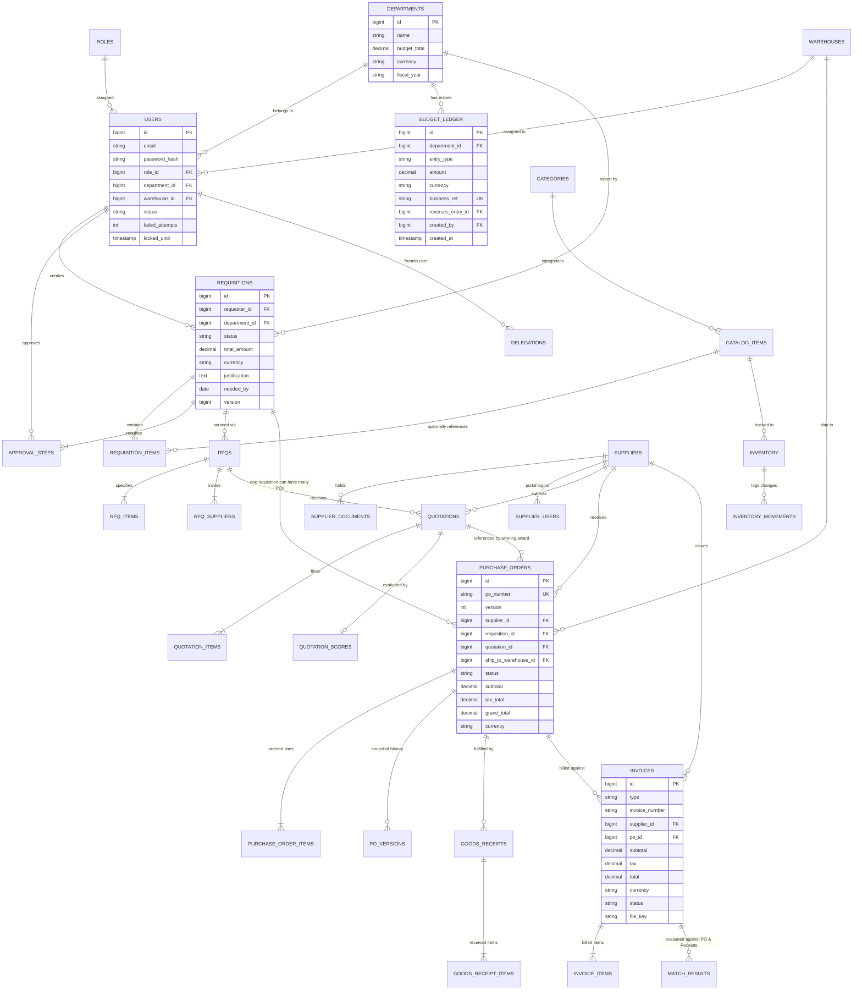

# Procura 2.0: Entity-Relationship Diagram

```mermaid
erDiagram
    DEPARTMENTS ||--o{ USERS : "belongs to"
    DEPARTMENTS ||--o{ BUDGET_LEDGER : "has entries"
    DEPARTMENTS ||--o{ REQUISITIONS : "raised by"
    ROLES ||--o{ USERS : "assigned"
    USERS ||--o{ REQUISITIONS : "creates"
    USERS ||--o{ APPROVAL_STEPS : "approves"
    USERS ||--o{ DELEGATIONS : "from/to user"
    WAREHOUSES ||--o{ USERS : "assigned to"
    WAREHOUSES ||--o{ PURCHASE_ORDERS : "ship to"

    CATEGORIES ||--o{ CATALOG_ITEMS : "categorizes"
    CATALOG_ITEMS ||--o{ REQUISITION_ITEMS : "optionally references"
    CATALOG_ITEMS ||--o{ INVENTORY : "tracked in"
    INVENTORY ||--o{ INVENTORY_MOVEMENTS : "logs changes"

    REQUISITIONS ||--|{ REQUISITION_ITEMS : "contains"
    REQUISITIONS ||--|{ APPROVAL_STEPS : "requires"
    REQUISITIONS ||--o{ RFQS : "sourced via"
    REQUISITIONS ||--o{ PURCHASE_ORDERS : "one requisition can have many POs"

    SUPPLIERS ||--o{ SUPPLIER_DOCUMENTS : "holds"
    SUPPLIERS ||--o{ SUPPLIER_USERS : "portal logins"
    SUPPLIERS ||--o{ QUOTATIONS : "submits"
    SUPPLIERS ||--o{ PURCHASE_ORDERS : "receives"
    SUPPLIERS ||--o{ INVOICES : "issues"

    RFQS ||--|{ RFQ_ITEMS : "specifies"
    RFQS ||--|{ RFQ_SUPPLIERS : "invites"
    RFQS ||--o{ QUOTATIONS : "receives"
    QUOTATIONS ||--|{ QUOTATION_ITEMS : "lines"
    QUOTATIONS ||--o| QUOTATION_SCORES : "evaluated by"
    QUOTATIONS ||--o{ PURCHASE_ORDERS : "referenced by winning award"

    PURCHASE_ORDERS ||--|{ PURCHASE_ORDER_ITEMS : "ordered lines"
    PURCHASE_ORDERS ||--o{ PO_VERSIONS : "snapshot history"
    PURCHASE_ORDERS ||--o{ GOODS_RECEIPTS : "fulfilled by"
    PURCHASE_ORDERS ||--o{ INVOICES : "billed against"

    GOODS_RECEIPTS ||--|{ GOODS_RECEIPT_ITEMS : "received items"
    INVOICES ||--|{ INVOICE_ITEMS : "billed items"
    INVOICES ||--o{ MATCH_RESULTS : "evaluated against PO & Receipts"

    USERS {
        bigint id PK
        string email
        string password_hash
        bigint role_id FK
        bigint department_id FK
        bigint warehouse_id FK
        string status
        int failed_attempts
        timestamp locked_until
    }

    DEPARTMENTS {
        bigint id PK
        string name
        decimal budget_total
        string currency
        string fiscal_year
    }

    BUDGET_LEDGER {
        bigint id PK
        bigint department_id FK
        string entry_type
        decimal amount
        string currency
        string business_ref UK
        bigint reverses_entry_id FK
        bigint created_by FK
        timestamp created_at
    }

    REQUISITIONS {
        bigint id PK
        bigint requester_id FK
        bigint department_id FK
        string status
        decimal total_amount
        string currency
        text justification
        date needed_by
        bigint version
    }

    PURCHASE_ORDERS {
        bigint id PK
        string po_number UK
        int version
        bigint supplier_id FK
        bigint requisition_id FK
        bigint quotation_id FK
        bigint ship_to_warehouse_id FK
        string status
        decimal subtotal
        decimal tax_total
        decimal grand_total
        string currency
    }

    INVOICES {
        bigint id PK
        string type
        string invoice_number
        bigint supplier_id FK
        bigint po_id FK
        decimal subtotal
        decimal tax
        decimal total
        string currency
        string status
        string file_key
    }
```
